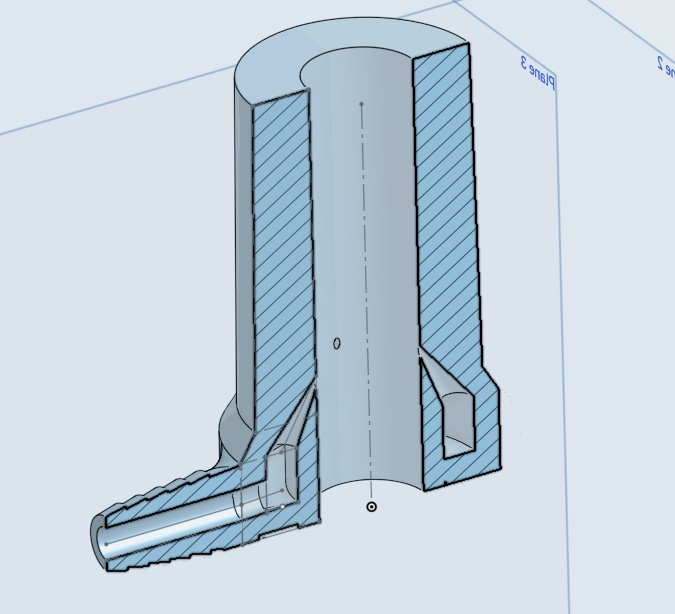
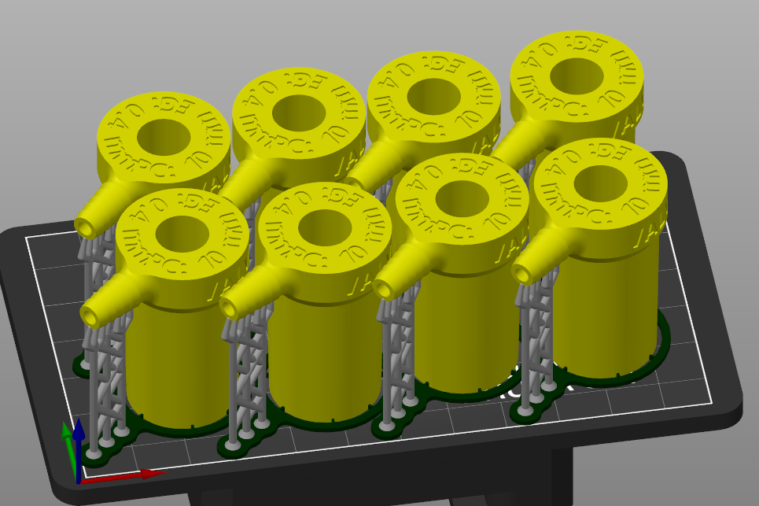
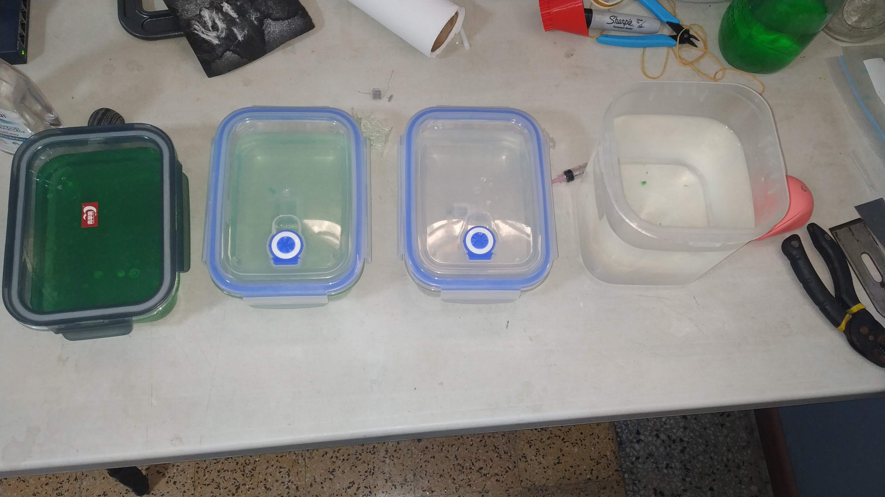
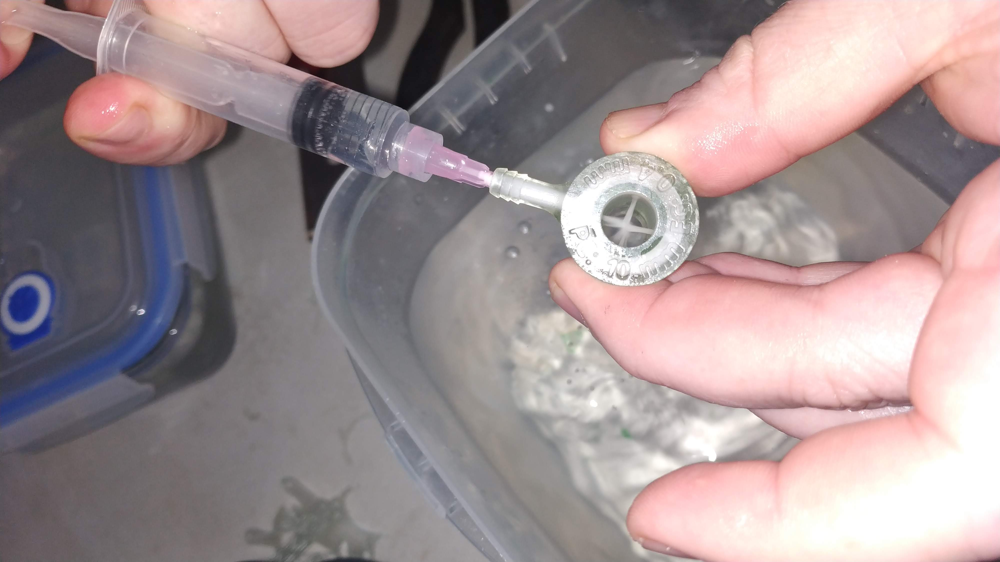

# Valve

The valve is designed to be printed using SLA printing. It's theoretically possible to achieve the required tolerances with FDM, but holding pressure at \~40 PSI is an additional challenge, easily met using SLA.

## Print Settings

In order to achieve the 0.4mm hole required to achieve the necessary airspeed, SLA exposure times will need to be reduced far below the defaults.

### AnyCubic Photon Z - "Basic" Resins

|-----------------|---------|
| Layer Thickness | 0.050mm |
| Normal Exposure | 3s      |
| Bottom Exposure | 60s     |

## Orientation / Supports

In order to minimize cleanup while preserving surface quality, it is recommended to print the valve with the barb attachment up, and generate supports for the barb. This also permits an increased print density when compared to an angled print.

## Post-Processing

### Washing

To wash the part of uncured resin, and preserve IPA supplies, a 4-wash process is advised (left to right):

* Step 1: IPA - bulk resin removal - remove supports after this
* Step 2: IPA - resin removal
* Step 3: IPA - final resin removal
* Step 4: Water - IPA removal

In addition to the usual concerns with washing SLA parts, the internal cavity of the void must be flushed of uncured resin. This step is also useful to verify that none of the egress holes have clogged during printing.

Flushing should be performed at each stage of the washing process to ensure the internal cavity is fully clear of uncured resin.

### Curing

Due to the reduced exposure times in printing, it is recommended to double standard curing times to ensure a full cure, especially of the interior cavity.